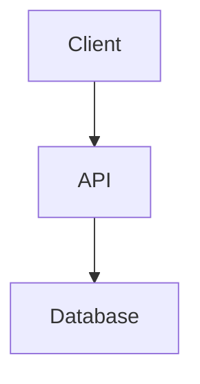

# Architecture: {{PROJECT_NAME}}

> Generated by Claude Code V7.7 on {{DATE}}

## Overview

{{DESCRIPTION}}

## Tech Stack

| Layer | Technology | Why |
|-------|------------|-----|
| Framework | {{FRAMEWORK}} | {{FRAMEWORK_REASON}} |
| Language | {{LANGUAGE}} | {{LANGUAGE_REASON}} |
| Database | {{DATABASE}} | {{DATABASE_REASON}} |
| Hosting | {{HOSTING}} | {{HOSTING_REASON}} |
| Auth | {{AUTH}} | {{AUTH_REASON}} |

## System Diagram



## Folder Structure

```
{{FOLDER_STRUCTURE}}
```

## Data Flow

{{DATA_FLOW}}

## Security Model

{{SECURITY_MODEL}}

## Key Decisions

| Decision | Choice | Rationale |
|----------|--------|-----------|
| {{DECISION_1}} | {{CHOICE_1}} | {{RATIONALE_1}} |

---

*Last updated: {{TIMESTAMP}}*
