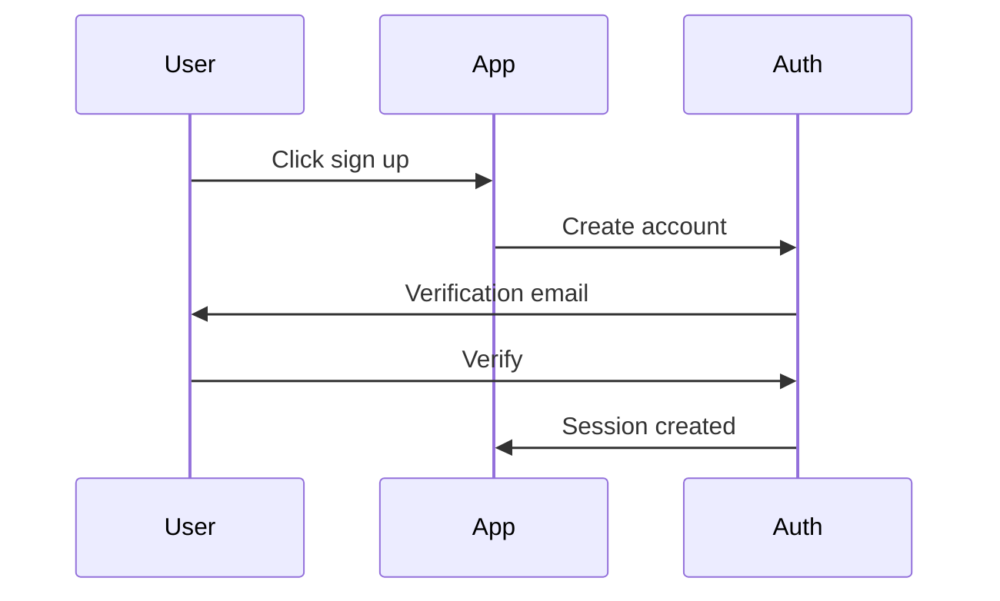
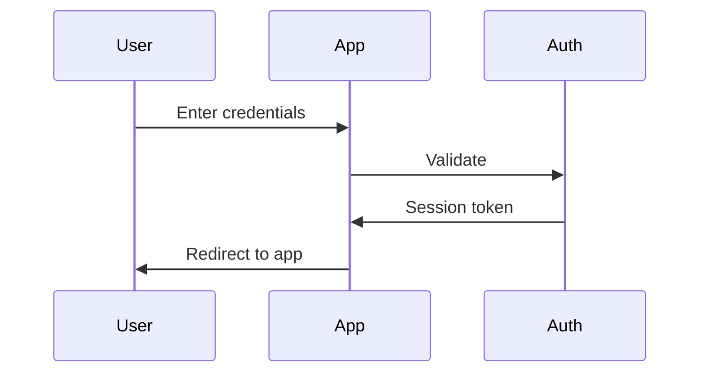
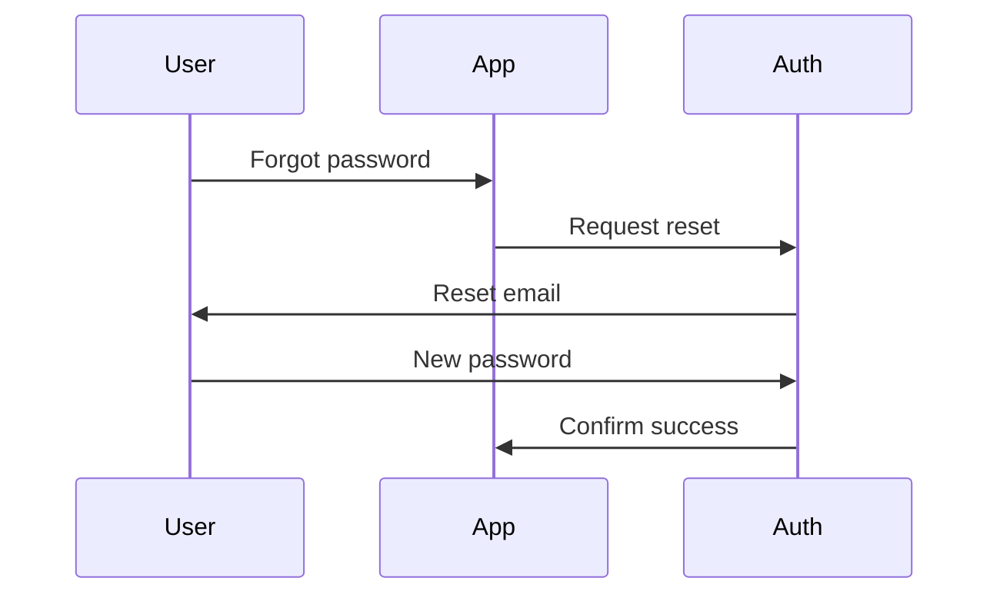

# Authentication Flows

> Generated by Claude Code V7.7

## Overview

**Provider:** {{AUTH_PROVIDER}}
**Methods:** {{AUTH_METHODS}}

## User Journey

### Sign Up

### Sign In

### Password Reset

## Session Management

**Storage:** {{SESSION_STORAGE}}
**Duration:** {{SESSION_DURATION}}
**Refresh:** {{REFRESH_STRATEGY}}

## Authorization

### Roles

| Role | Permissions |
|------|-------------|
| {{ROLE_1}} | {{PERMISSIONS_1}} |
| {{ROLE_2}} | {{PERMISSIONS_2}} |

### Protected Routes

| Route | Required Role |
|-------|---------------|
| {{ROUTE_1}} | {{ROLE_REQ_1}} |
| {{ROUTE_2}} | {{ROLE_REQ_2}} |

## Security Measures

- [ ] CSRF protection
- [ ] Rate limiting on auth endpoints
- [ ] Password hashing algorithm: {{HASH_ALGORITHM}}
- [ ] Session invalidation on password change
- [ ] Secure cookie settings (httpOnly, secure, sameSite)

---

*Last updated: {{TIMESTAMP}}*
