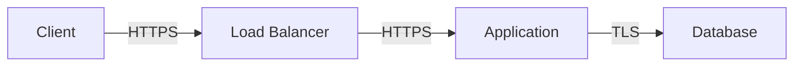

# Security Documentation

> Generated by Claude Code V7.7

## Security Overview

**Last Security Review:** {{LAST_REVIEW_DATE}}
**Next Review Due:** {{NEXT_REVIEW_DATE}}

## Authentication

| Aspect | Implementation |
|--------|----------------|
| Provider | {{AUTH_PROVIDER}} |
| Password Hashing | {{HASH_ALGORITHM}} |
| Session Management | {{SESSION_TYPE}} |
| Token Expiry | {{TOKEN_EXPIRY}} |

## Authorization Model

### Roles & Permissions

| Role | Create | Read | Update | Delete | Admin |
|------|--------|------|--------|--------|-------|
| {{ROLE_1}} | {{C1}} | {{R1}} | {{U1}} | {{D1}} | {{A1}} |
| {{ROLE_2}} | {{C2}} | {{R2}} | {{U2}} | {{D2}} | {{A2}} |

### Resource Access

| Resource | Public | Authenticated | Owner | Admin |
|----------|--------|---------------|-------|-------|
| {{RESOURCE_1}} | {{PUB1}} | {{AUTH1}} | {{OWN1}} | {{ADM1}} |
| {{RESOURCE_2}} | {{PUB2}} | {{AUTH2}} | {{OWN2}} | {{ADM2}} |

## Data Protection

### Sensitive Data Inventory

| Data Type | Storage | Encryption | Retention |
|-----------|---------|------------|-----------|
| Passwords | Database | bcrypt/argon2 | Until deleted |
| Sessions | Redis/DB | AES-256 | {{SESSION_RETENTION}} |
| PII | Database | At rest | {{PII_RETENTION}} |
| {{CUSTOM_DATA}} | {{STORAGE}} | {{ENCRYPTION}} | {{RETENTION}} |

### Data Flow



## Security Controls

### Input Validation

- [ ] All user input validated server-side
- [ ] Type checking enforced (TypeScript/Zod)
- [ ] Length limits on all fields
- [ ] SQL injection prevention (parameterized queries)
- [ ] XSS prevention (output encoding)

### API Security

- [ ] Authentication required for protected endpoints
- [ ] Rate limiting enabled
- [ ] CORS properly configured
- [ ] Request size limits
- [ ] API versioning

### Infrastructure

- [ ] HTTPS enforced (HSTS)
- [ ] Security headers configured
- [ ] WAF enabled (if applicable)
- [ ] DDoS protection
- [ ] Regular security updates

## Security Headers

```
Strict-Transport-Security: max-age=31536000; includeSubDomains
X-Content-Type-Options: nosniff
X-Frame-Options: DENY
Content-Security-Policy: default-src 'self'
Referrer-Policy: strict-origin-when-cross-origin
```

## Secrets Management

| Secret | Storage | Rotation |
|--------|---------|----------|
| Database credentials | Environment | {{DB_CRED_ROTATION}} |
| API keys | Environment | {{API_KEY_ROTATION}} |
| JWT secrets | Environment | {{JWT_ROTATION}} |

## Incident Response

1. **Detection:** Monitor alerts, error tracking
2. **Containment:** Isolate affected systems
3. **Investigation:** Determine scope and impact
4. **Remediation:** Fix vulnerability, patch
5. **Recovery:** Restore service, verify fix
6. **Post-mortem:** Document lessons learned

---

*Last updated: {{TIMESTAMP}}*
