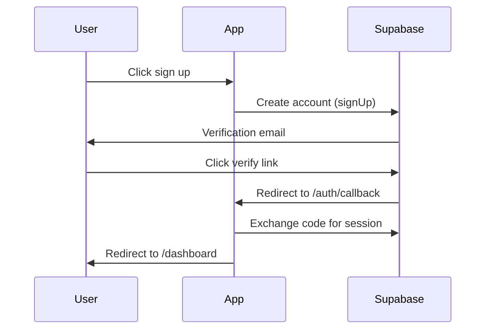
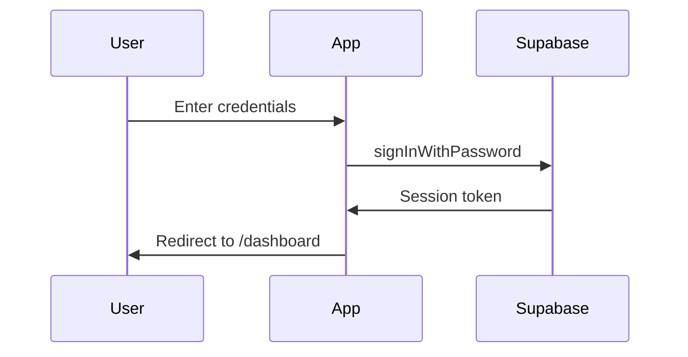
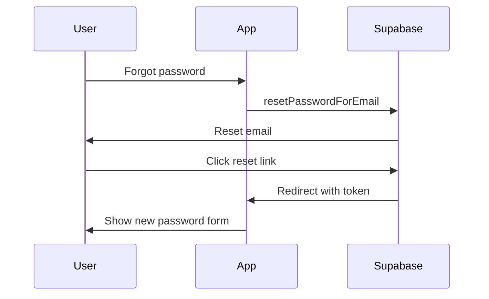

# Authentication Flows

> Generated by Claude Code V7.7

## Overview

**Provider:** Supabase Auth
**Methods:** Email/Password

## User Journey

### Sign Up

**Implementation:** `src/app/(auth)/signup/page.tsx`

### Sign In

**Implementation:** `src/app/(auth)/login/page.tsx`

### Password Reset

**Status:** Not yet implemented

## Session Management

**Storage:** HTTP-only cookies via Supabase SSR
**Duration:** 1 hour access token, 1 week refresh token
**Refresh:** Automatic via middleware on each request

### Middleware

Location: `src/middleware.ts`

The middleware:

1. Refreshes the session on every request
2. Checks if route is protected
3. Redirects to login if unauthenticated
4. Redirects authenticated users away from auth pages

## Authorization

### Roles

| Role  | Permissions                                   |
| ----- | --------------------------------------------- |
| User  | Access own dashboard, subscriptions, invoices |
| Admin | All user permissions + manage plans (future)  |

### Protected Routes

| Route                 | Required Role |
| --------------------- | ------------- |
| /dashboard            | User          |
| /dashboard/billing    | User          |
| /dashboard/plans      | User          |
| /api/subscriptions/\* | User          |

### Public Routes

| Route                | Description     |
| -------------------- | --------------- |
| /                    | Landing page    |
| /login               | Login page      |
| /signup              | Signup page     |
| /api/webhooks/stripe | Stripe webhooks |

## Security Measures

- [x] CSRF protection (Supabase handles via cookies)
- [x] Rate limiting on auth endpoints (Supabase default)
- [x] Password hashing: bcrypt (Supabase default)
- [x] Session invalidation on password change
- [x] Secure cookie settings (httpOnly, secure, sameSite)

### Security Checklist

- [x] No secrets in code (use env vars)
- [x] No secrets in logs
- [x] .env in .gitignore
- [x] All user input validated
- [x] Password minimum 8 characters
- [x] Email format validated
- [x] Proper error messages (no stack traces)

## Implementation Files

| File                             | Purpose                 |
| -------------------------------- | ----------------------- |
| `src/app/(auth)/login/page.tsx`  | Login form UI           |
| `src/app/(auth)/signup/page.tsx` | Signup form UI          |
| `src/app/auth/callback/route.ts` | OAuth callback handler  |
| `src/middleware.ts`              | Route protection        |
| `src/lib/supabase/client.ts`     | Browser Supabase client |
| `src/lib/supabase/server.ts`     | Server Supabase client  |
| `src/lib/supabase/middleware.ts` | Session management      |

---

_Last updated: 2024-12-23_
