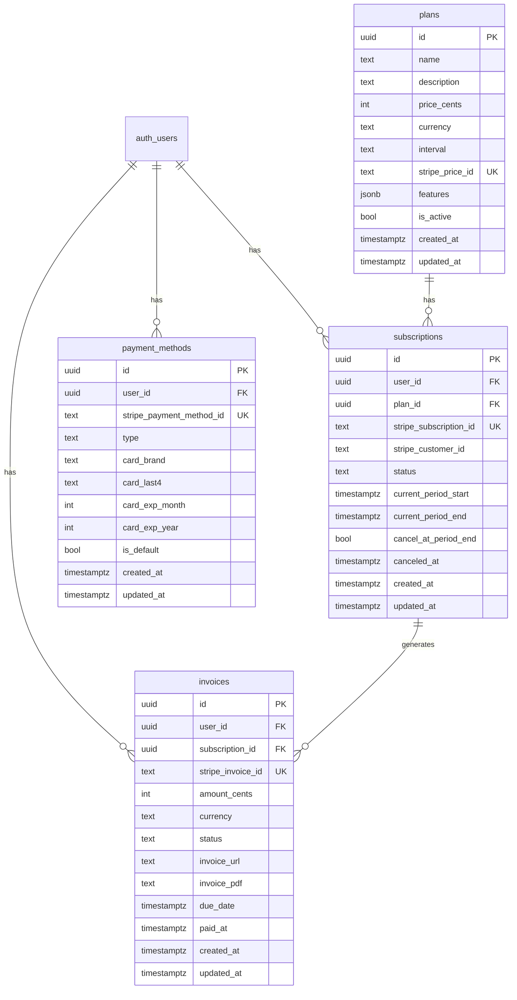

# Data Models

> Generated by Claude Code V7.7

## Database

**Type:** PostgreSQL (Supabase)
**ORM:** Supabase Client

## Entity Relationship Diagram



## Conventions

- **Tables:** plural, snake_case (users, order_items)
- **Columns:** snake_case (first_name, created_at)
- **Foreign keys:** singular_id (user_id, order_id)
- **Indexes:** table_column_idx (users_email_idx)

## Standard Columns

Every table includes:

```sql
id          UUID PRIMARY KEY DEFAULT gen_random_uuid()
created_at  TIMESTAMPTZ NOT NULL DEFAULT now()
updated_at  TIMESTAMPTZ NOT NULL DEFAULT now()
```

## Tables

### plans

Stores subscription plan definitions synced from Stripe.

| Column          | Type        | Constraints             | Description               |
| --------------- | ----------- | ----------------------- | ------------------------- |
| id              | UUID        | PK                      | Primary key               |
| name            | TEXT        | NOT NULL                | Plan display name         |
| description     | TEXT        | -                       | Plan description          |
| price_cents     | INTEGER     | NOT NULL                | Price in cents            |
| currency        | TEXT        | NOT NULL, DEFAULT 'usd' | Currency code             |
| interval        | TEXT        | NOT NULL, CHECK         | 'month' or 'year'         |
| stripe_price_id | TEXT        | NOT NULL, UNIQUE        | Stripe Price ID           |
| features        | JSONB       | NOT NULL, DEFAULT '[]'  | Feature list              |
| is_active       | BOOLEAN     | NOT NULL, DEFAULT true  | Whether plan is available |
| created_at      | TIMESTAMPTZ | NOT NULL                | Creation timestamp        |
| updated_at      | TIMESTAMPTZ | NOT NULL                | Last update               |

**Indexes:**

- plans_stripe_price_id_idx: stripe_price_id (unique lookup)
- plans_is_active_idx: partial index on is_active = true

**RLS Policies:**

- Anyone can read active plans

---

### subscriptions

Tracks user subscription status and billing periods.

| Column                 | Type        | Constraints             | Description                                  |
| ---------------------- | ----------- | ----------------------- | -------------------------------------------- |
| id                     | UUID        | PK                      | Primary key                                  |
| user_id                | UUID        | FK, NOT NULL            | References auth.users                        |
| plan_id                | UUID        | FK, NOT NULL            | References plans                             |
| stripe_subscription_id | TEXT        | NOT NULL, UNIQUE        | Stripe Subscription ID                       |
| stripe_customer_id     | TEXT        | NOT NULL                | Stripe Customer ID                           |
| status                 | TEXT        | NOT NULL, CHECK         | active, canceled, past_due, trialing, paused |
| current_period_start   | TIMESTAMPTZ | NOT NULL                | Billing period start                         |
| current_period_end     | TIMESTAMPTZ | NOT NULL                | Billing period end                           |
| cancel_at_period_end   | BOOLEAN     | NOT NULL, DEFAULT false | Pending cancellation                         |
| canceled_at            | TIMESTAMPTZ | -                       | When canceled                                |
| created_at             | TIMESTAMPTZ | NOT NULL                | Creation timestamp                           |
| updated_at             | TIMESTAMPTZ | NOT NULL                | Last update                                  |

**Relationships:**

- belongs_to: auth.users via user_id
- belongs_to: plans via plan_id
- has_many: invoices

**Indexes:**

- subscriptions_user_id_idx: user_id (FK lookup)
- subscriptions_plan_id_idx: plan_id (FK lookup)
- subscriptions_stripe_subscription_id_idx: stripe_subscription_id
- subscriptions_stripe_customer_id_idx: stripe_customer_id
- subscriptions_status_idx: status

**RLS Policies:**

- Users can view/insert/update own subscriptions

---

### invoices

Stores invoice records from Stripe for billing history.

| Column            | Type        | Constraints             | Description                            |
| ----------------- | ----------- | ----------------------- | -------------------------------------- |
| id                | UUID        | PK                      | Primary key                            |
| user_id           | UUID        | FK, NOT NULL            | References auth.users                  |
| subscription_id   | UUID        | FK                      | References subscriptions               |
| stripe_invoice_id | TEXT        | NOT NULL, UNIQUE        | Stripe Invoice ID                      |
| amount_cents      | INTEGER     | NOT NULL                | Invoice amount in cents                |
| currency          | TEXT        | NOT NULL, DEFAULT 'usd' | Currency code                          |
| status            | TEXT        | NOT NULL, CHECK         | draft, open, paid, void, uncollectible |
| invoice_url       | TEXT        | -                       | Hosted invoice URL                     |
| invoice_pdf       | TEXT        | -                       | PDF download URL                       |
| due_date          | TIMESTAMPTZ | -                       | Payment due date                       |
| paid_at           | TIMESTAMPTZ | -                       | When paid                              |
| created_at        | TIMESTAMPTZ | NOT NULL                | Creation timestamp                     |
| updated_at        | TIMESTAMPTZ | NOT NULL                | Last update                            |

**Relationships:**

- belongs_to: auth.users via user_id
- belongs_to: subscriptions via subscription_id

**Indexes:**

- invoices_user_id_idx: user_id (FK lookup)
- invoices_subscription_id_idx: subscription_id (FK lookup)
- invoices_stripe_invoice_id_idx: stripe_invoice_id
- invoices_status_idx: status
- invoices_created_at_idx: created_at DESC (recent first)

**RLS Policies:**

- Users can view own invoices

---

### payment_methods

Stores user payment method information from Stripe.

| Column                   | Type        | Constraints             | Description                         |
| ------------------------ | ----------- | ----------------------- | ----------------------------------- |
| id                       | UUID        | PK                      | Primary key                         |
| user_id                  | UUID        | FK, NOT NULL            | References auth.users               |
| stripe_payment_method_id | TEXT        | NOT NULL, UNIQUE        | Stripe PaymentMethod ID             |
| type                     | TEXT        | NOT NULL, CHECK         | 'card' or 'bank_account'            |
| card_brand               | TEXT        | -                       | Card brand (visa, mastercard, etc.) |
| card_last4               | TEXT        | -                       | Last 4 digits                       |
| card_exp_month           | INTEGER     | -                       | Expiration month                    |
| card_exp_year            | INTEGER     | -                       | Expiration year                     |
| is_default               | BOOLEAN     | NOT NULL, DEFAULT false | Default payment method              |
| created_at               | TIMESTAMPTZ | NOT NULL                | Creation timestamp                  |
| updated_at               | TIMESTAMPTZ | NOT NULL                | Last update                         |

**Relationships:**

- belongs_to: auth.users via user_id

**Indexes:**

- payment_methods_user_id_idx: user_id (FK lookup)
- payment_methods_stripe_payment_method_id_idx: stripe_payment_method_id
- payment_methods_is_default_idx: partial index on user_id, is_default = true

**RLS Policies:**

- Users can view/insert/update/delete own payment methods

---

_Last updated: 2024-12-23_
